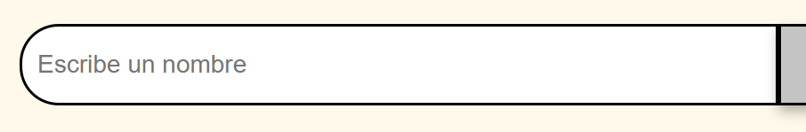
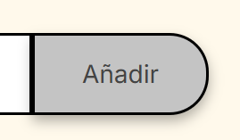
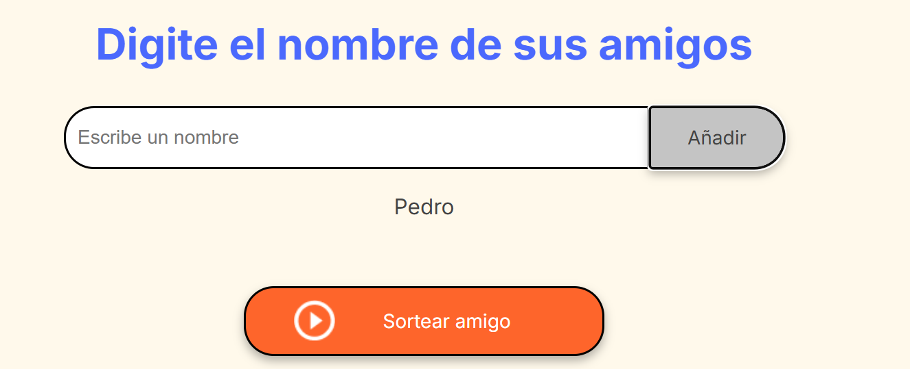
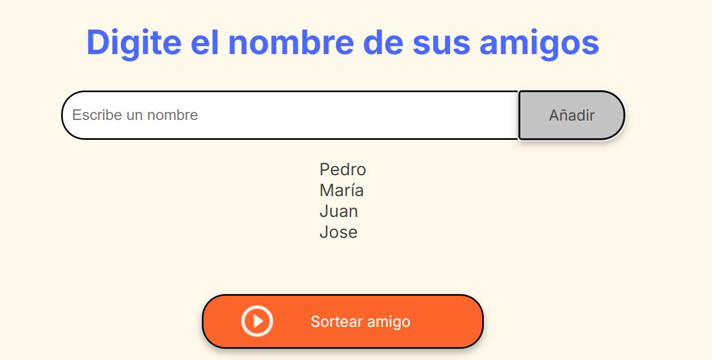
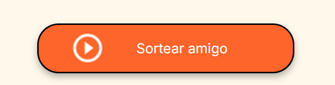
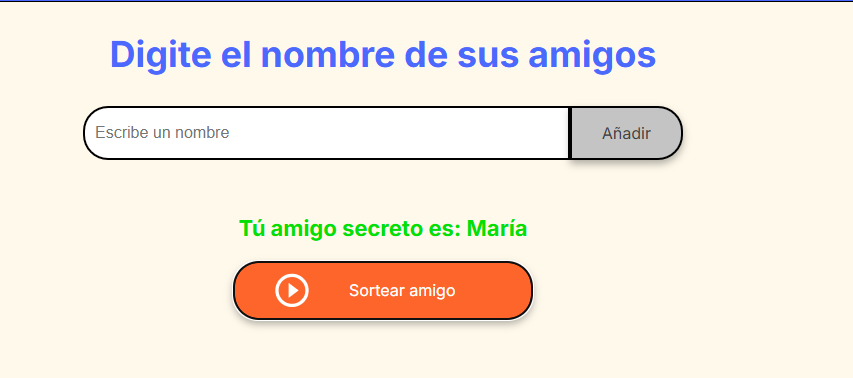
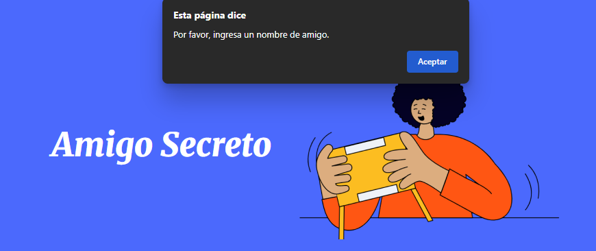
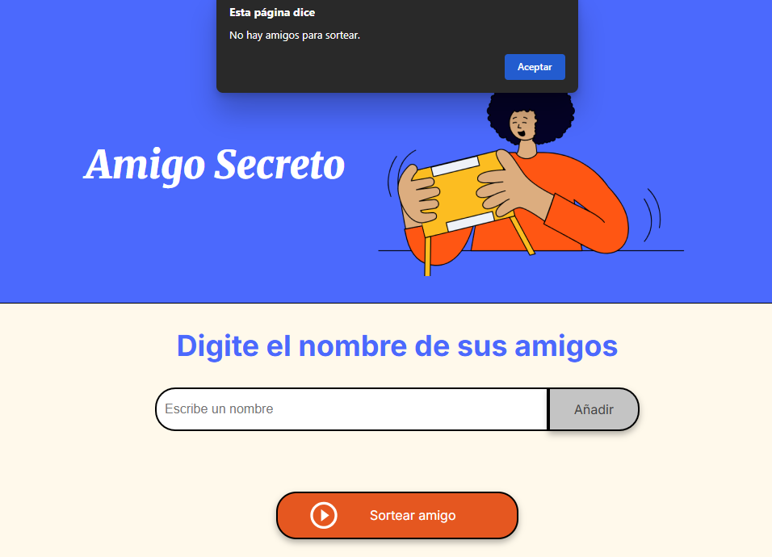

# Challengue del Amigo Secreto

## Video demostratorio

## Instrucciones

Para usarlo debes:

1. Ingresar el nombre del 'Amigo secreto' por agregar en el cuadro de texto.

   

2. Hacer click en el boton 'Añadir'.

   

3. El nombre del nuevo amigo secreto se agregara a la lista inferior.

   

4. Repite hasta que hayas agregado a todos los amigos secretos.

   

5. Haz click en 'Sortear amigo'.

   

6. Verás el nombre del amigo ganador

   

## Consideraciones

- Toma en cuenta siempre escribir algo en el campo del nombre de amigo antes de hacer click en añadir, o veras:

  

- Siempre antes de hacer click en Sortear amigo, debe haber una lista de amigos o veras:

  
